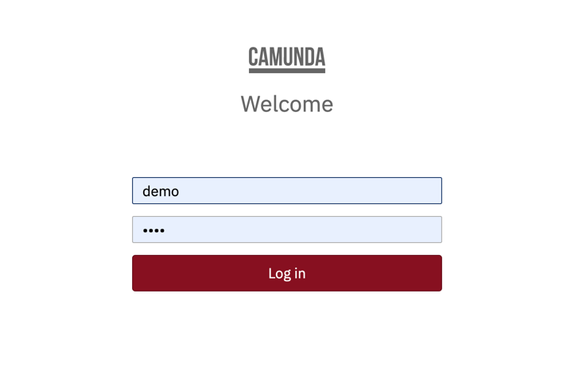
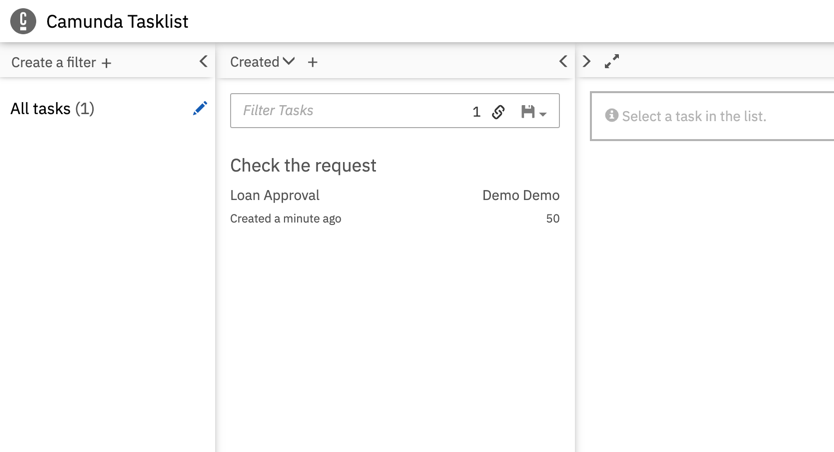

# Document Processing MicroService
This is a simple api project that process pdf file and abstract valuable information.

## Assumptions
1. No database is used as there is no requirement for data persistence.
2. Build server has java 1.11 runtime environment, and gradle.

### Requirement
Given a pdf file, as a business user I want the content abstracted from the file with the clear mapping between title and its content.

Explore the option on how Camunda can be implemented using Java Springboot.


## Technologies & Tools used
1. Java 1.17, Spring boot
2. Build tool – Gradle 6.4

### How to run
To run this application follow the below gradle command.

```
gradle clean build
```

### Testing
To run the application on test pdf file, hit the below endpoint
```
POST => http://localhost:8080/api/app/document/document
```
On success
it shoudl return
```
Status: 201 Created
```

### Camunda
Along with pdf file processing, Camunda has been implementd as well with the sample workflow.

* [Camunda dashboard](http://localhost:8080/camunda/app/)

Enter user name - demo/demo


Tasklist

